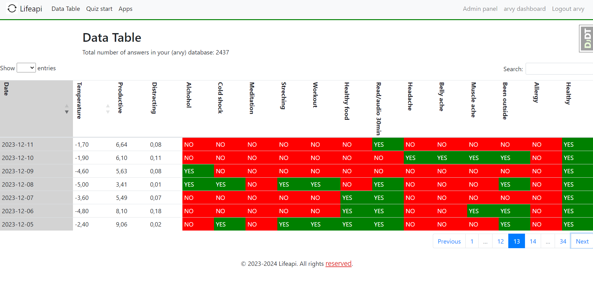
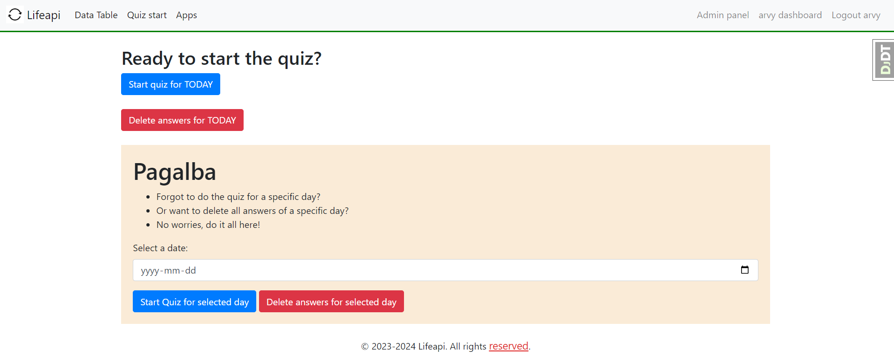

# Lifeapi

> Why not track everything about myself? 

Instead of writing a manual journal each evening, why not pull various info from API's of the apps that I am using daily? I am big on tracking things, storing things, reflecting on things.. this app will be perfect for that. I can see myself using it for years to come.. :)\

## Inspiration for this app

* Big big inspiration - using SQL as a life database [reddit post](https://www.reddit.com/r/SQL/comments/rru1re/using_sql_as_a_life_database/?utm_source=share&utm_medium=android_app&utm_name=androidcss&utm_term=1&utm_content=share_button).
* Telegram bot example - [howisfelix.today site](https://howisfelix.today). His site on [github](https://github.com/KrauseFx/FxLifeSheet).
* Tracking in excel also looks fine [excample 1](https://dailyvis.com/posts/quantified-self-why-i-track-my-life-in-data/), [example 2](https://dailyvis.com/posts/self-analysis-with-my-quantified-self-data/), [example 3](https://dailyvis.com/vis/compare/demo/).

## Things to track

[ ] - not implemented yet

[x] - implemented

- [ ] strava api ( fetch workouts, duration, kms)
- [ ] chrome history (fetch)
- [ ] instagram (fetch something)
- [ ] duolingo (fetch streak, words learned, time spent)
- [ ] YouTube (fetch what I have watched or minutes)
- [x] workouts (y/n manual inpput)
- [ ] weight (fetch kgs)
- [x] computer time ( fetch rescue time)
- [x] !database size (entries, like felix)
- [ ] unique website visitors (like felix)
- [ ] Swarm? My location ( fetch like felix)
- [x] weather each day
- [x] meditated or not (manual input, or app?)
- [ ] what programming language I used the most ( fetch some app)
- [x] cold shower or not (manual input)
- [x] my mood (manual input like felix)
- [ ] daily steps (fetch some phone app)
- [x] healthy or not (like felix) Good to know by season or by activity level or by what I have been eating
- [x] alchohol consuption (y/n like felix)
- [ ] location (fetch from some location app. see how mood changes by location, Maybe nah)
- [x] check ins (manual input like felix) (cafe, office, metro, gym, train station, hotel)
- [x] slept (hours in the night)
- [x] sleep quality (manual input)
- [x] mood in the morning (manual input)(removed)
- [x] streched (manual input)
- [ ] bike kms (fetch)
- [ ] !listened to audiobook/podcast (true/false)
- [x] Read (manual input y/n)
- [x] confidence (1-5)(removed)
- [x] decisiveness (1-5)(removed)
- [ ] emacs usage
- [ ] ate (fish/meat/veggies/trash food) (like dailyvis)
- [ ] what google pin I placed (fetched)
- [ ] shazammed songs (fetched)
- [x] just simple notes/journal of how I felt(manual input)
- [x] every chatgpt question of mine(nah, questions can be too big) (fetched)
- [ ] onedrive photos also? nah, too much space in that way I could start sharing more of my content knowing that it  would go directly where I want, in one place, for future me or whoever to watch.(fetched)
- [ ] spotify listening duration/what listened (fetched)
- [ ] Linkedin connections (fetched)
- [ ] shutterstock sales (fetched)
- [ ] expenses (fetched)
- [x] worked from home or not (manual input)
- [x] m / s (manual input)
- [x] pikt for no reason (scale) (manual input)
- [x] learned something (manual input y/n)
- [x] works
- [x] works too
